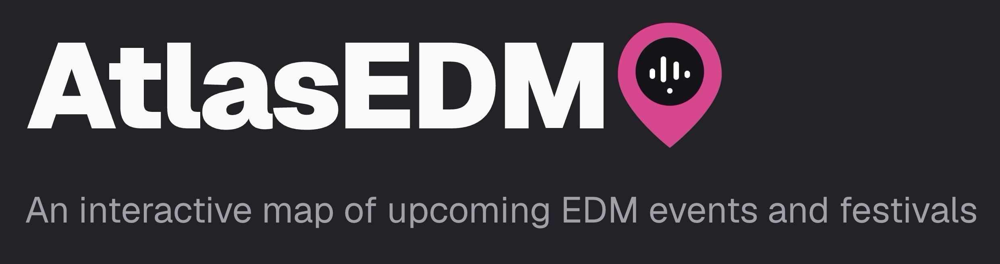
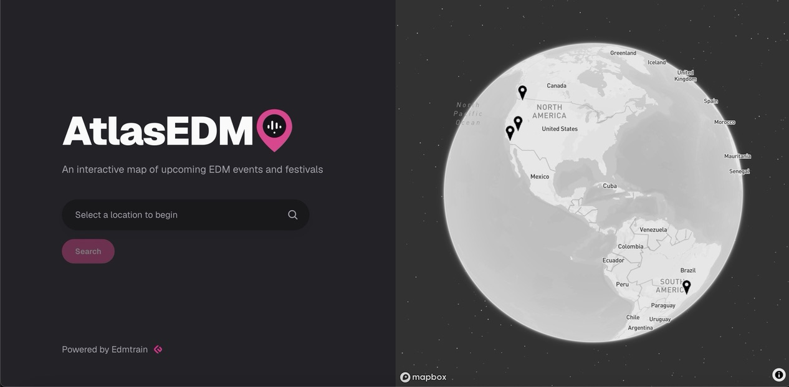
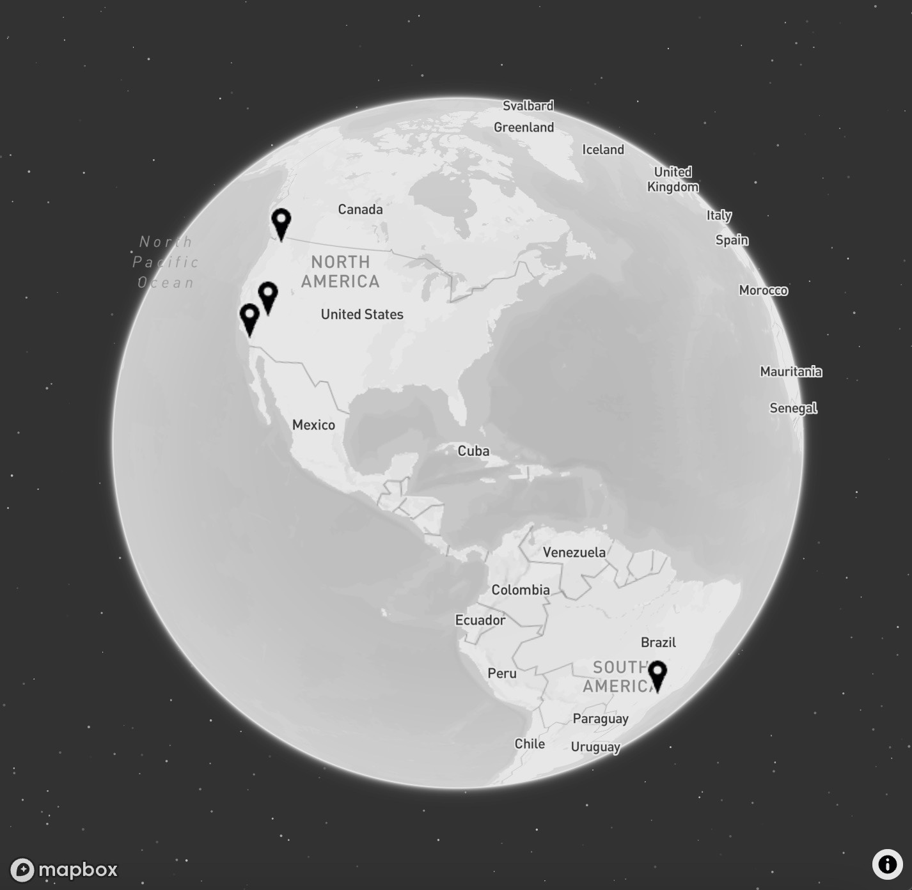
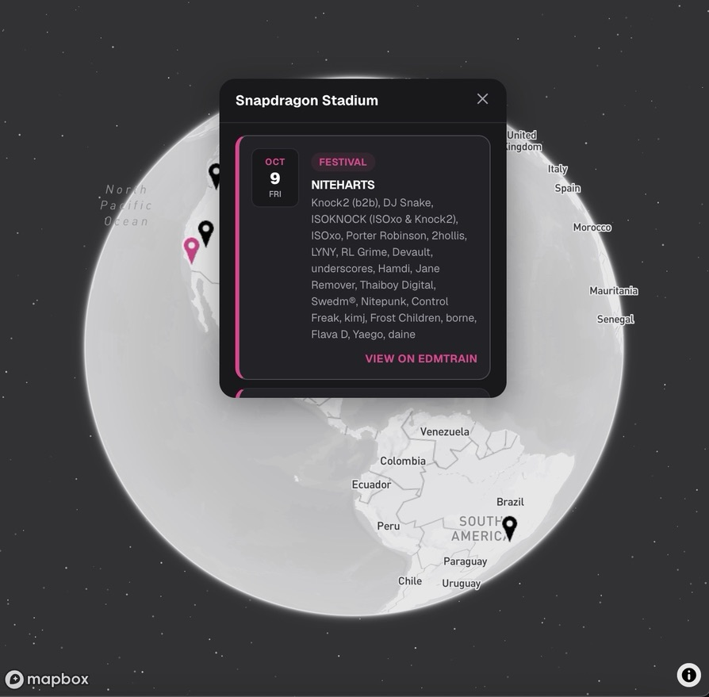
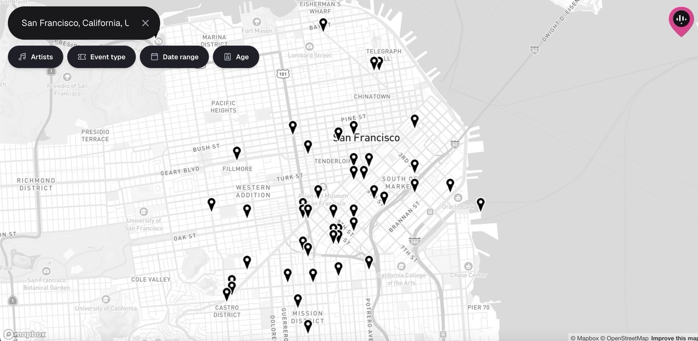
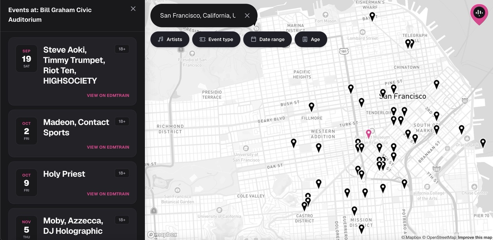
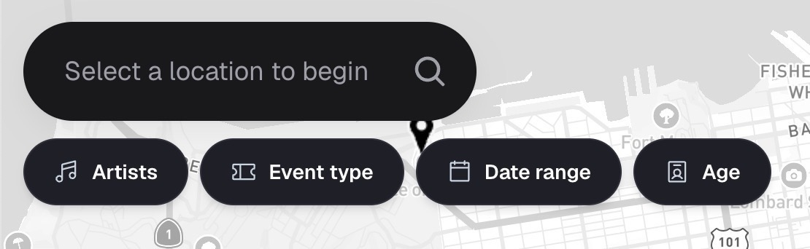
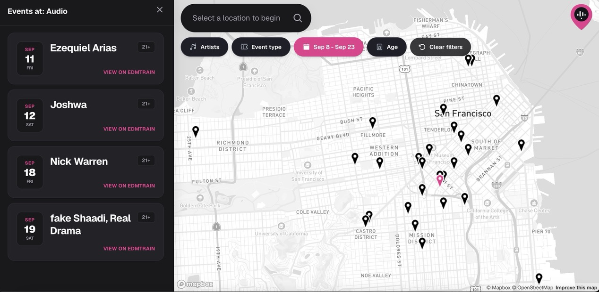

  

  <a href="https://atlasedm.com"><b>atlasedm.com</b></a>

## Overview

When I first got into EDM, one of the sites I used to disover upcoming events on was [Edmtrain](https://edmtrain.com). It tracks upcoming shows and festivals across venues and lets fans search by city or by the artists they follow. While looking into how their data worked, I found that Edmtrain offers a public API, and that every event in its database comes with real latitude/longitude venue coordinates.

As someone who's into EDM, geography, and interactive data visualization, I built AtlasEDM - an interactive map that plots upcoming EDM events and festivals using Edmtrain's own data. It's a fun way to explore events happening near a city (or anywhere in the world) while making it easier to discover what's happening through an interactive map rather than a traditional list.

## Landing Page

  

The landing page is where a search starts. Type in a city, a general location, or a specific venue by name, and you'll see a map of what's events in that area.

  

To the right of the search bar sits a decorative globe, plotting a handful of the world's largest EDM festivals alongside a few of my own personal favorites. Every pin is clickable.

> Pins on the globe (and the map itself) can take anywhere from 30 seconds to a minute to load if the site hasn't been visited recently — a little context on why: the backend runs on a free hosting tier, which spins the server down after a period of inactivity to save resources, and spinning back up isn't instant. Once it's warm, everything loads normally.

  

Clicking a pin pops up a card with real event details for that festival — lineup, date, and a link straight to Edmtrain. It's the same idea the map page runs with, just at a global scale.

## Map Page

Searching a city or venue drops you into the map page itself. Here's what it looks like after searching "San Francisco":

  

Every pin is a real venue with upcoming events. Selecting one opens its full event list:

  

Same pattern as the globe's popup cards, scaled up into a full panel — dates, lineups, age restrictions, and a link out to Edmtrain for tickets and further details on every show.

## Search Filters

  

Four filters sit on top of the map:

- **Artists** — narrow events down to specific artists you search for and select.
- **Event type** — festivals only, single-artist shows only, or both.
- **Date range** — restrict results to a specific window of time.
- **Age** — filter by age restriction (18+, 21+, etc.).

  

Pins narrow down on the map as filters are applied — in this example, to a specific date range. Filtering re-queries live data, so it can take a few seconds to a minute to settle, especially right after the backend's been idle.

## Tech Stack

**Frontend** — Next.js (App Router) + TypeScript + Tailwind CSS, deployed on Vercel. Mapbox GL JS powers both the globe and the map itself, with Phosphor Icons and Motion for iconography and animation.

**Backend** — a REST API written in C++ with the [Drogon](https://github.com/drogonframework/drogon) framework, backed by PostgreSQL (with PostGIS for the geographic queries) and Redis for response caching.

**Data pipeline** — a Python script syncs upcoming events from Edmtrain's API into the database on a daily schedule.

**Infrastructure** — the backend, database, cache, and sync job all run as Docker containers on Render; the frontend deploys separately on Vercel.

## Limitations

The backend and its Docker containers run on free-tier hosting, which comes with real tradeoffs — the server spinning down after inactivity (the 30-second-to-a-minute delays mentioned above) chief among them, along with modest memory and compute limits that can occasionally slow down heavier requests. These are the honest constraints of running this as a personal project rather than a funded production service, not a permanent design decision.

---

Big thanks to [Edmtrain](https://edmtrain.com) for the event data that makes AtlasEDM possible.

If you run into any issues with the site, feel free to email me at **matthewcendana.business@gmail.com**.
